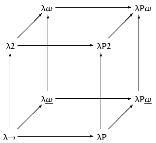

# 4. Type theory

There are some type theories that can serve as an alternative foundation of mathematics, as opposed to standard set theory (i.e. ZFC). One such well known type theory is Martin-L&#246;f's intuitionistic theory of types, which is an extension of Alonzo Church's simply typed {$$}\lambda{/$$}-calculus. Before we begin working with Idris, we will get familiar with these theories, upon which Idris is built as a language.

I> ### Definition 1
I>
I> Type theory is defined as a class of formal systems. In these theories, every object is joined with a type, and operations upon these objects are constrained by the joined types. In order to say that {$$}x{/$$} is of type {$$}\text{X}{/$$}, we denote {$$}x : \text{X}{/$$}. Functions are a primitive concept in type theory [^ch4n1].

For example, with {$$}1 : \text{Nat}, 2 : \text{Nat}{/$$} we can say that 1 and 2 are of type {$$}\text{Nat}{/$$}, that is natural numbers. An operation (function) {$$}+ : \text{Nat} \to \text{Nat} \to \text{Nat}{/$$} is interpreted as a function which takes two objects of type {$$}\text{Nat}{/$$} and returns an object of type {$$}\text{Nat}{/$$}.

I> ### Definition 2
I>
I> In type theory, a type constructor is a function that builds new types from old ones. This function accepts types and as a result it returns a new type.

Idris supports algebraic data types. These data types are a kind of complex types, that is, types constructed by combining other types. Two classes of algebraic types are **product types** and **sum types**.

I> ### Definition 3
I>
I> Algebraic data types are types where we can additionally specify the form for each of the elements. They are called "algebraic" in the sense that the data types are constructed using algebraic operations. The algebra here is sum and product:
I>
I> 1. Sum (union) is alternation. It is denoted as {$$}\text{A | B}{/$$} and it means that the value is either of type A or B, but not both.
I> 1. Product is combination. It is denoted as {$$}\text{A B}{/$$} and it means that the value is a pair where the first element is of type A, and the second element is of type B.

As an example, we can assume that we have two types: {$$}\text{Nat}{/$$} for natural numbers, and {$$}\text{Real}{/$$} for real numbers. Now, for the sum (union) we can construct a new type {$$}\text{Nat | Real}{/$$}. Valid values of this type are {$$}1 : \text{Nat | Real}{/$$}, {$$}3.14 : \text{Nat | Real}{/$$}, etc. For the product type, we can construct a new type {$$}\text{Nat Real}{/$$}. Valid values of this type are {$$}1 1.5 : \text{Nat Real}{/$$}, {$$}2 3.14 : \text{Nat Real}{/$$}, etc. With this, sums and products can be combined and thus more complex data structures can be defined.

Finally, Idris supports dependent types[^ch4n2]. These kind of types are so powerful, they can encode most properties of programs, and with their help Idris can prove invariants at compile-time. This is what makes Idris a so called proof assistant[^ch4n3]. As we will see in section 5.2, types also allow us to encode mathematical proofs, which brings computer programs closer to mathematical proofs. As a consequence, this allows us to prove properties (e.g. specifications) about our software.

Q> ### Why are types useful?
Q>
Q> Russell's paradox (per the mathematician Bertrand Russell) states the following: In a village in which there is only one barber, there is a rule according to which the barber shaves everyone who don't shave themselves, and no-one else. Now, who shaves the barber? In order to attempt to solve the paradox, we can assume that the barber shaves himself. Then, he's one of those who shave themselves, but the barber shaves only those who do not shave themselves, which is a contradiction. Alternatively, if we assume that the barber does not shave himself, then he is in the group of people whom which the barber shaves, which again is a contradiction.
Q>
Q> The (naive) set theoretical foundations were affected by this paradox. As a response to this, between 1902 and 1908, Bertrand Russell himself proposed different type theories an attempt to resolve the issue. By joining types to values, we avoid the paradox because in this theory every set is defined as having elements from a distinct type, for example, {$$}\text{Type 1}{/$$}. Elements from {$$}\text{Type 1}{/$$} can be included in a different set, say, elements of {$$}\text{Type 2}{/$$}, and so forth. Thus, the paradox is no longer an issue since the set of elements of {$$}\text{Type 1}{/$$} cannot be contained in their own set, since the types do not match. In a way, we're adding hierarchy to sets in order to resolve the issue of "self-referential" sets. This is also the case with Idris, where we have that {$$}\text{Type : Type 1 : Type 2}{/$$}, etc.
Q>
Q> Thus, for Russell's paradox specifically, if we set the type of a person to be {$$}\text{P}{/$$}, then the list of people would be of type {$$}\text{List P}{/$$}. However, there is no way to express {$$}\{ \text{P} \lvert \text{P} \in \text{P} \}{/$$}, since {$$}\text{List P}{/$$} only contains elements of type {$$}\text{P}{/$$}, and not {$$}\text{List P}{/$$}.

## 4.1. Lambda calculus

I> ### Definition 4
I>
I> Lambda calculus is a formal system for expressing computation[^ch4n4].
I> Per Wikipedia, the set of symbols for this system is defined as:
I>
I> 1. There are variables {$$}v_1, v_2, \ldots{/$$}
I> 1. There are only two abstract symbols: {$$}.{/$$} and {$$}\lambda{/$$}
I> 1. There are parentheses: {$$}({/$$} and {$$}){/$$}
I>
I> The set of grammar rules {$$}\Lambda{/$$} for well-formed expressions is defined as:
I>
I> 1. If {$$}x{/$$} is a variable, then {$$}x \in \Lambda{/$$}
I> 1. If {$$}x{/$$} is a variable and {$$}M \in \Lambda{/$$}, then {$$}(\lambda x.M) \in \Lambda{/$$} (rule of abstraction)
I> 1. If {$$}M, N \in \Lambda{/$$}, then {$$}(M \ N) \in \Lambda{/$$} (rule of application)

Abstraction is when we define a function to which no arguments are applied, that is, there are no function calls. Application is when we apply arguments to some defined function.

Some well-formed expressions are {$$}\lambda f \ x . f \ x{/$$} and {$$}\lambda f \ x . f \ (f \ x){/$$}. In fact, we can encode numbers this way. The first example can be thought of as the number one, and the second as the number two. This encoding is known as the Church encoding. Operations on numbers (plus, minus, etc) can also be defined in a similar way. With the {$$}\lambda{/$$} symbol we begin an abstraction, and with the {$$}.{/$$} symbol we separate the abstraction from the function body. In other words, 1 is defined roughly as {$$}f(x){/$$}, and 2 as {$$}f(f(x)){/$$}. Note that {$$}f{/$$} and {$$}x{/$$} do not have special definitions, they are abstract objects.

X> ### Exercise 1
X>
X> Convince yourself that the expression {$$}\lambda f \ x . f \ x{/$$} is a well-formed expression by writing down each one of the grammar rules used.

### 4.1.1. Terms reduction

I> ### Definition 5
I>
I> There are two types of variables in the Lambda calculus: free and bound. Bound variables are those who appear within the {$$}\lambda{/$$} abstraction. Analogously, free variables are those who do not appear in the {$$}\lambda{/$$} abstraction.

For example, in the expression {$$}\lambda y . x \ y{/$$} we have that {$$}y{/$$} is a bound variable, and {$$}x{/$$} is a free one.

I> ### Definition 6
I>
I> The rules of terms reduction allow us to compute (simplify) lambda expressions. There are three types of reduction:
I>
I> 1. {$$}\alpha{/$$} - (alpha) reduction: Renaming bound variables
I> 1. {$$}\beta{/$$} - (beta) reduction: Applying arguments to functions
I> 1. {$$}\eta{/$$} - (eta) reduction: Two functions are "equal" iff they return the same result for all arguments

For example, for the expression {$$}(\lambda x . f \ x) \ y{/$$}, we can use alpha reduction to get to {$$}(\lambda z . f \ z) \ y{/$$}, by changing {$$}x{/$$} to {$$}z{/$$}. Using beta reduction, the expression can further be reduced to just {$$}f \ y{/$$}, since we "consumed" the {$$}z{/$$} by removing it from the abstraction, and wherever it occured in the body we just replaced it with what was applied to it, that is, {$$}y{/$$}. Finally, with eta reduction, we can rewrite {$$}(\lambda x . f \ x){/$$} to just {$$}f{/$$}, since they are equivalent.

Given these rules, we can define the successor function as {$$}SUCC = \lambda n\ f\ x\ . f\ (n\ f\ x){/$$}. So, now we can try to apply 1 to {$$}SUCC{/$$}:

1. Evaluating {$$}SUCC \ 1 ={/$$}
1. Substitute the very own definitions of {$$}SUCC{/$$} and 1: {$$}(\lambda n \ f \ x . f \ (n \ f \ x)) \ (\lambda f \ x . f \ x) ={/$$}
1. Apply 1 to {$$}SUCC{/$$}, that is, "consume" the {$$}n{/$$} by using beta reduction: {$$}\lambda f \ x . f \ ((\lambda f \ x . f \ x) \ f \ x) ={/$$}
1. Finally, apply {$$}f{/$$} and {$$}x{/$$} to a function that accepts {$$}f{/$$} and {$$}x{/$$} (which is just the body of the abstraction): {$$}\lambda f \ x . f \ (f \ x) = 2{/$$}

X> ### Exercise 2
X>
X> Evaluate {$$}SUCC \ 2{/$$} to find out the definition of number 3.

X> ### Exercise 3
X>
X> Come up with your own functions that operates on the Church numerals. It can be as simple as returning the same number, or a constant one.

## 4.2. Lambda calculus with types

I> ### Definition 5
I>
I> Simply typed lambda calculus is a type theory which adds types to lambda calculus. It joins the system with a unique type constructor {$$}\to{/$$} which constructs types for functions. The formal definition and the set of lambda expressions is similar to that of lambda calculus, with the addition of types.
I>
I> The set of symbols for this system is defined as:
I>
I> 1. There are variables {$$}v_1, v_2, \ldots{/$$}
I> 1. There are only two abstract symbols: {$$}.{/$$} and {$$}\lambda{/$$}
I> 1. There are parentheses: {$$}({/$$} and {$$}){/$$}
I>
I> The set of grammar rules {$$}\Lambda{/$$} for well-formed expressions is defined as:
I>
I> 1. If {$$}x{/$$} is a variable, then {$$}x \in \Lambda{/$$}
I> 1. If {$$}x{/$$} is a variable and {$$}M \in \Lambda{/$$}, then {$$}(\lambda x.M) \in \Lambda{/$$} (rule of abstraction)
I> 1. If {$$}M, N \in \Lambda{/$$}, then {$$}(M \ N) \in \Lambda{/$$} (rule of application)
I> 1. If {$$}x{/$$} is a variable, {$$}T{/$$} is a type, and {$$}M \in \Lambda{/$$}, then {$$}(\lambda x:T.M) \in \Lambda{/$$}
I> 1. If {$$}x{/$$} is a variable and {$$}T{/$$} is a type, then {$$}x:T \in \Lambda{/$$}
I>
I> The type constructors are:
I>
I> 1. For some type {$$}A{/$$}, the type constructor {$$}T{/$$} is defined as {$$}\text{A | T} \to \text{T}{/$$}

That is, an expression in this system can additionally be an abstraction with {$$}x{/$$} having joined a type (rule 4), or an expression of a variable having joined a type {$$}\text{T}{/$$} (rule 5), where our type constructor is a sum type, and it says that we either have primitive types, or a way to form new types. Now in our attempt to re-define Church numerals and the successor function, we have to be careful as the types of these definitions have to match. Let's recall the Church numerals:

1. Number 1, i.e. {$$}\lambda f \ x . f \ x{/$$}
1. Number 2, i.e. {$$}\lambda f \ x . f \ (f \ x){/$$}

Given the definition of 1, its type must have the form {$$}(\text{a} \to \text{b}) \to \text{a} \to \text{b}{/$$} for some {$$}\text{a}{/$$} and {$$}\text{b}{/$$}. We are expecting to be able to apply {$$}x{/$$} to {$$}f{/$$}, and so if {$$}x : \text{a}{/$$} then {$$}f : \text{a} \to \text{b}{/$$} in order for our types to match correctly. With similar reasoning, we have the same type for 2. So at this point, we have the type of {$$}(\text{a} \to \text{b}) \to \text{a} \to \text{b}{/$$}. Finally, with the given definition of 2, we can note that expressions of type {$$}\text{b}{/$$} need to be able to be applied to functions of type {$$}\text{a} \to \text{b}{/$$}, since the result of applying {$$}f{/$$} to {$$}x{/$$} serves as the argument of {$$}f{/$$}. The most general way for that to be true is if {$$}a = b{/$$}. So, as a result we have the type {$$}(\text{a} \to \text{a}) \to \text{a} \to \text{a}{/$$}. We can denote this type definition to be {$$}\text{Nat}{/$$}. Now we have the following for our numbers:

1. Number 1 becomes {$$}\lambda [f:(\text{a} \to \text{a})] \ [x : \text{a}] . f \ x : \text{Nat}{/$$}
1. Number 2 becomes {$$}\lambda [f:(\text{a} \to \text{a})] \ [x : \text{a}] . f \ (f \ x) : \text{Nat}{/$$}

The (typed) successor function is: {$$}SUCC = \lambda [n:\text{Nat}]\ [f:(\text{a} \to \text{a})] \ [x : \text{a}] . f\ (n\ f\ x) : \text{Nat} \to \text{Nat}{/$$}

X> ### Exercise 4
X>
X> Come up with a definition of the typed number 3.

X> ### Exercise 5
X>
X> Apply the typed {$$}SUCC{/$$} to 1 and confirm the result is 2. Make sure you confirm that the types also match in the process of evaluation.

X> ### Exercise 6
X>
X> In exercise 3 you were asked to come up with a function. Try to figure out the types of this function, or if not applicable, come up with a new function and then figure out its types using the reasoning above.

## 4.3. Dependent types

I> ### Definition 6
I>
I> Dependent types are types whose definition depends on some value.

A list of numbers is a type ({$$}\text{List}{/$$}, for example). However, a list of numbers where the second element of the list is larger than the first element of the list is a dependent type.

I> ### Definition 7
I> ###
I> A dependent product type is a collection of types {$$}B : \text{A} \to U{/$$} where for each element {$$}a : \text{A}{/$$}, there's an assigned type {$$}B(a) : U{/$$}, where {$$}U{/$$} is a universe of types[^ch4n5]. We say that {$$}B(a){/$$} varies with {$$}a{/$$}. It is denoted as {$$}\Pi(x : \text{A}), B(x){/$$}.

This definition might seem a bit scary and tricky to grasp, but it really is simple, and as usual we'll show an example. Let's consider the following cases:

1. Our universe of types contains all possible types. For example, {$$}\text{Type}{/$$}, {$$}\text{Nat}{/$$}, etc, so {$$}U = \{ \text{Type}, \text{Nat}, \text{List n}, \ldots \}{/$$}
1. Our collection of interest of types is {$$}\text{List n}{/$$}, which represents a list of {$$}n{/$$} elements. That is, {$$}A = \{ \text{List n} \}{/$$}

Now the definition states that, in our universe {$$}U{/$$}, there exists a function {$$}B(n) = \text{List n}{/$$}. {$$}B{/$$} is the collection of functions which given a number {$$}n{/$$}, will return a list of {$$}n{/$$} numbers. So, we have the following list as an example: {$$}[1] : \text{B(1)}{/$$}, that is {$$}[1] : \text{List 1}{/$$}. Another example list is {$$}[1, 2] : \text{List 2}{/$$}, and so on. In general, we have a function that takes an {$$}n{/$$} and produces a {$$}\text{List n}{/$$}, that is, {$$}f : \text{n} \to \text{List n}{/$$}, where the possible types for it are {$$}f : 1 \to \text{List 1}{/$$}, {$$}f : 2 \to \text{List 2}{/$$}, etc. We've just constructed our first dependent type!

I> ### Definition 8
I>
I> A dependent sum type can be used to represent indexed pairs, where the type of the second element depends on the type of the first element. That is, if we have {$$}a : \text{A}{/$$} and {$$}b : \text{B(a)}{/$$}, then this makes a sum type. We denote it as {$$}\Sigma(x : \text{A}), B(x){/$$}.

For example, if we set {$$}A = \text{Nat}{/$$}, and {$$}B(a) = \text{List a}{/$$}, i.e. {$$}\Sigma(x : \text{Nat}), \text{List x}{/$$}, we can construct the following pairs: {$$}(1, [1]), (2, [1, 2]), (3, [1, 2, 3]){/$$}, etc.

X> ### Exercise 7
X>
X> Think of a way to construct a different product dependent type, and express it using the reasoning above.

X> ### Exercise 8
X>
X> Think of a way to construct a different sum dependent type, and express it using the reasoning above.

## 4.4. Intuitionistic theory of types

The core "construct" in Idris are types. As we've seen, foundations are based on type theory. As we've also seen, in classic mathematical logic we have sets and propositions, according to the ZFC set theory.

The intuitionistic theory of types (or constructive type theory) offers an alternative foundation to mathematics. This theory was introduced by Martin-L&#246;f, a swedish mathematician in 1972. It is based on the isomorphism (or "equality") that propositions are types. We will cover this in details in 5.2, after introducing Idris's syntax.

Proving a theorem in this system consists of constructing[^ch4n6], or providing evidence for a particular object. If we want to prove something about a type {$$}\text{A}{/$$}, and we know that {$$}a : \text{A}{/$$}, then {$$}a{/$$} is one proof for {$$}\text{A}{/$$}. Note how we say one proof, because there can be many other elements of type {$$}\text{A}{/$$}.

Propositions can also be defined through types. For example. in order to prove that {$$}4 = 4{/$$}, we need to find an object {$$}x{/$$} of type {$$}\text{4 = 4}{/$$}, that is {$$}x : \text{4 = 4}{/$$}. One such object is {$$}refl{/$$} (which can be thought of as an axiom), which stands for reflexivity, which states that {$$}x = x{/$$} for all {$$}x{/$$}.

One thing worth noting is that, in Idris there are "two" types of truths: {$$}\text{Bool}{/$$} and {$$}\text{Type}{/$$}. Even though there is some similarity (in terms of proofs), in Idris they are fundamentally different. The type {$$}\text{Bool}{/$$} can have a value of {$$}True{/$$} or {$$}False{/$$}, while the type {$$}\text{Type}{/$$} is either provable or not provable[^ch4n7].

This system is useful since with the usage of computer algorithms we can find a constructive proof for some object (assuming it exists). As a consequence, this is why it can be considered as a way to make a programming language act like a proof-assistant.

I> ### Definition 9
I>
I> A context is defined as a list of variables {$$}x_1 : \text{A}_1, x_2 : \text{A}_2, x_3 : \text{A}_3, \ldots{/$$}

I> ### Definition 10
I>
I> A formal definition of Intuitionistic theory is that it consists of objects and types.
I>
I> The grammar of well formed formulas in this system are:
I>
I> 1. {$$}\Gamma \vdash s : \text{Type}{/$$}, that is, {$$}s{/$$} is a well formed type in context {$$}\Gamma{/$$}
I> 1. {$$}\Gamma \vdash t : \text{s}{/$$}, that is, {$$}t{/$$} is a well formed expression of type {$$}\text{s}{/$$} in context {$$}\Gamma{/$$}
I> 1. {$$}\Gamma \vdash \text{s} = \text{t}{/$$}, that is, s and t are the same type in context {$$}\Gamma{/$$}
I> 1. {$$}\Gamma \vdash t = u : \text{s}{/$$}, that is, t and u are equal expressions of type s in context {$$}\Gamma{/$$}
I> 1. {$$}\vdash \Gamma{/$$}, that is, {$$}\Gamma{/$$} is a well formed context of types
I>
I> The type constructors are:
I>
I> 1. {$$}\Pi{/$$} types and {$$}\Sigma{/$$} types, as we've discussed them earlier
I> 1. Finite types, that is, the nullary (empty) type 0 or {$$}\bot{/$$}, the unary type 1 or {$$}\top{/$$}, and the boolean type 2
I> 1. The equality type, where for given {$$}a, b : \text{A}{/$$}, the expression {$$}a = b{/$$} represents proof of equality. There is a canonical element {$$}a = a{/$$}, that is, an "axiom" for the reflexivity proof: {$$}refl : \Pi \text{(a : A) a = a}{/$$}
I> 1. Inductive (or recursive) types, for example {$$}\text{Nat = Z | S Nat}{/$$}. In this way we can implement product and sum types which encode conjunction and disjunction respectively
I>
I> The inference rules are:
I>
I> 1. The rule of type equality which states that if an object is of a type {$$}\text{A}{/$$}, and there is another type {$$}\text{B}{/$$} equal to {$$}\text{A}{/$$}, then that object is of type {$$}\text{B}{/$$}: {$$}(\Gamma \vdash a : \text{A}, \Gamma \vdash \text{A} = \text{B}) \vdash (\Gamma \vdash a : \text{B}){/$$}
I>
I> The remaining inference rules are specific to the type formers, for example introduction and elimination. We will show an example using these rules in 5.2.

As an example, rule 1 says that we can form an expression such that an object inhabits the type {$$}\text{Type}{/$$}, so an example of a well formed expression is {$$}1 : \text{Nat}{/$$}, per rule 2, and {$$}\text{Nat} : \text{Type}{/$$} per rule 1.

X> ### Exercise 9
X>
X> We've used rule 1 and rule 2 in example 2. Try to come up with different ways to use each one of the rules described above.

X> ### Exercise 10
X>
X> Combine the usage of rules along with the connectives described above, so for example, try to come up with a recursive type and then try to construct some new objects from it.

### 4.4.1. Intuitionistic logic

I> ### Definition 10
I>
I> A constructive proof proves the existence of a mathematical object by creating or constructing the object itself. This is contrary to non-constructive proofs which prove existence of objects without giving a concrete example.

I> ### Definition 11
I>
I> Intuitionistic logic, also known as constructive logic, is a type of logic which is different than the classical logic in that it "works" with the notion of constructive proof.

I> ### Definition 12
I>
I> The BHK (Brouwer-Heyting-Kolmogorov) interpretation is a mapping of intuitionistic logic to classical mathematical logic, namely:
I>
I> 1. A proof of {$$}P \land Q{/$$} is a product type {$$}\text{A B}{/$$}, where {$$}a{/$$} is a proof of {$$}\text{P}{/$$} and {$$}b{/$$} is a proof of {$$}\text{Q}{/$$}
I> 1. A proof of {$$}P \lor Q{/$$} is a product type {$$}\text{A B}{/$$}, where {$$}a{/$$} is 0 and {$$}b{/$$} is a proof of {$$}\text{P}{/$$}, or {$$}a{/$$} is 1 and {$$}b{/$$} is a proof of {$$}\text{Q}{/$$}
I> 1. A proof of {$$}P \to Q{/$$} is a function {$$}f{/$$} that converts a proof of {$$}\text{P}{/$$} to a proof of {$$}\text{Q}{/$$}
I> 1. A proof of {$$}\exists x \in S : f(x){/$$} is a pair {$$}\text{A B}{/$$} where {$$}a{/$$} is an element of {$$}\text{S}{/$$}, and {$$}b{/$$} is a proof of {$$}f(x){/$$} (dependent sum types)
I> 1. A proof of {$$}\forall x \in S : f(x){/$$} is a function {$$}f{/$$} that converts an element {$$}a{/$$} from {$$}\text{S}{/$$} to a proof of {$$}f(x){/$$} (dependent product types)
I> 1. A proof of {$$}\lnot P{/$$} is defined as {$$}P \to \bot{/$$}, that is, the proof is a function {$$}f{/$$} that converts a proof of {$$}\text{P}{/$$} to proof of {$$}\bot{/$$}
I> 1. There is no proof of {$$}\bot{/$$}

For example, to prove distributivity of {$$}\land{/$$} with respect to {$$}\lor{/$$}, that is, {$$}P \land (Q \lor R) = (P \land Q) \lor (P \land R){/$$}, we need to construct a proof for the function of type {$$}f : \text{P (Q | R)} \to \text{P Q | P R}{/$$}. That is, a function that takes a product type of {$$}\text{P}{/$$} and sum type of {$$}\text{Q}{/$$} and {$$}\text{R}{/$$}, and returns a sum type of product {$$}\text{P}{/$$} and {$$}\text{Q}{/$$}, and product {$$}\text{P}{/$$} and {$$}\text{R}{/$$}. Here's the function that accomplishes that:

```
f (x, left y) = left (x, y)
f (x, left y') = right (x, y')
```

This notation (which is pretty similar to how we would write it in Idris), uses `(x, y)` to denote product type, that is, extract values from a product-type pair, and `left` and `right` to denote type constructors for sum type in order to extract values from a sum-type pair. In the next chapter we will introduce Idris and its syntax.

X> ### Exercise 11
X>
X> Try to use some of the proofs in the earlier chapters as a motivation and work them out using intuitionistic logic.

## 4.5. Lambda cube

In mathematics, the lambda cube represents the extensions to simply typed lambda calculus (bottom-left), where each direction is a separate extension. Each axis of the cube has its own form of abstraction.



Even though the cube has 8 kinds of systems, we will only cover the 4 most important that relate to Idris:

1. Expressions depending on expressions, using the simply typed lambda calculus {$$}\lambda \to{/$$}:
    1. Grammar rules: {$$}x, \lambda x:\text{T} . t, t \ t{/$$}
    1. Type constructors: {$$}\text{T} \to \text{T}{/$$}
    1. Example: The Church numerals we've discussed before: 1, {$$}\lambda[f : (\text{a} \to \text{a})]\ [x : \text{a}] . f \ x : \text{Nat}{/$$}
1. Expressions depending on types, that is, polymorphism. This is called System F {$$}\lambda 2{/$$}:
    1. Grammar rules: {$$}x, \lambda x:\text{T} . t, t \ t, \lambda X.t{/$$}
    1. Type constructors: {$$}\text{X}, \forall \text{X.T}{/$$}
    1. Example: The polymorphic function {$$}concat : \text{List a} \to \text{List a} \to \text{List a}{/$$}, where the same {$$}\text{a}{/$$} is bound to all arguments.
1. Types depending on types. This is called System lambda-omega {$$}\lambda \omega{/$$}:
    1. Grammar rules: {$$}x, \lambda x:\text{T} . t, t \ t{/$$}
    1. Type constructors: {$$}\text{X}, \lambda \text{X:K.T}, \text{T T}{/$$}
    1. Example: {$$}\text{List a}{/$$}, where {$$}\text{a}{/$$} can be {$$}\text{Nat}{/$$}, {$$}\text{Real}{/$$}, etc.
1. Types depending on expressions, that is, dependent types. This is called System LF {$$}\lambda P{/$$}:
    1. Grammar rules: {$$}x, \lambda x:\text{T} . t, t \ t{/$$}
    1. Type constructors: {$$}\Pi x:\text{T . T}, \text{T t}{/$$}
    1. Example: The dependently-typed function {$$}concat : \text{List 3} \to \text{List 5} \to \text{List 8}{/$$}, where {$$}\text{List}{/$$} limits the number of elements at a type level.

The system in the upper-right angle {$$}\lambda P \omega{/$$} represents Calculus of Constructions. It is a separate type theory that is used by the interactive theorem prover Coq. We will not get into the details of this type theory as part of this book.

[^ch4n1]: Unlike in set theory, where they are defined in terms of relations.

[^ch4n2]: Dependent types are the reason why Idris can formally prove mathematical statements, compared to other programming languages. While useful, since we can check whether an expression fulfills a given condition at compile-time, dependent types add complexity to a type system. In order to calculate type "equality" of dependent types, computations are necessary. If we allow any values for dependent types, then solving an equality of a type may involve deciding whether two programs produce the same result. Thus, the check may become undecidable.

[^ch4n3]: In general, Idris combines a lot of functionalities from mainstream languages (Java, C, C++), and some functionalities from proof assistants, which further blurs the limit between these two kinds of software.

[^ch4n4]: A Turing machine can express any algorithm. Any formal system that can simulate a Turing machine is called Turing complete. Since a Turing machine can express any algorithm, so does any Turing complete system. This property is used to show equivalence of formal systems in terms of the algorithms they can express. (Untyped) Lambda calculus is Turing complete.

[^ch4n5]: Collections in general are considered to be subcollections of some large universal collection, also called the universe. Depending on the context, the definition of this universe will vary.

[^ch4n6]: As a consequence that we need to provide an object as an evidence in order to prove something, the law of excluded middle {$$}P \lor \lnot P{/$$} is not defined in this logic, whereas in classic mathematical logic this is given as an axiom. For some propositions, for example, {$$}P{/$$} is an odd number or not, there are proofs that we can provide. However, for some propositions this is impossible, for example, {$$}P{/$$} is a program that halts or not. So, unlike classic mathematical logic, in this logic the law of excluded middle does not exist due to the undecidability problem.

[^ch4n7]: It is provable in case we can construct an object of such type, and not provable otherwise.
